# Traffic Light Detection, Depth Estimation, and Decision Making Algorithm

<!-- PROJECT SHIELDS -->
<!--
*** I'm using markdown "reference style" links for readability.
*** Reference links are enclosed in brackets [ ] instead of parentheses ( ).
*** See the bottom of this document for the declaration of the reference variables
*** for contributors-url, forks-url, etc. This is an optional, concise syntax you may use.
*** https://www.markdownguide.org/basic-syntax/#reference-style-links
-->
<!--[![Contributors][contributors-shield]][contributors-url]
[![Forks][forks-shield]][forks-url]
[![Stargazers][stars-shield]][stars-url]
[![Issues][issues-shield]][issues-url]
[![MIT License][license-shield]][license-url]-->


<!-- PROJECT LOGO -->
<br />
<p align="center">
  <a href="https://github.com/othneildrew/Best-README-Template">
    
  </a>

<!-- ABOUT THE PROJECT -->
# About The Project

Traffic lights are control flow devices that guarantee security for drivers. Due to the lack of concentration and slow reaction from 
the drivers, this might lead into car accidents. Therefore, this project aims to contribute to with the implementation of a ***Emergency
 Brake Driver Assitant System from Traffic Lights using Deep Learning and a Fuzzy Logic Decision-Making Algorithm*** which will be computed 
 using a [Nvidia Jetson TX2](https://developer.nvidia.com/embedded/jetson-tx2-developer-kit) and a [ZED Stereo Camera](https://www.stereolabs.com/zed/). 

This project is the second part of my master thesis from Tecnologico de Monterrey, the name of the thesis is ***Emergency Brake Driver Assitant 
System from Traffic Lights using Deep Learning and a Fuzzy Logic Decision-Making Algorithm***. This second part consist of using the trained model 
from the first part and perform inference using the Jetson TX2, estimate the depth of the traffic light using the ZED stereo camera, and perform a 
fuzzy logic decision-making algorithm using the distance and the traffic light state, the output of the fuzzy system is a value from 0 to 1 that is 
considered to be the ***brake signal***. 

# 1. Built with
## 1.1. Environment
The project was built using:
* Tensorflow 2.3.1
* Bazel 3.1.0
* Tensorflow Addons 0.13.0
* Jetpack 4.5.1 (L4T.R32.5.1)
* CUDA 10.2
* cuDNN 8.0
* Python 3.6.9
* Ubuntu 18.04 LTS
* ROS2 Eloquent
* ZED SDK for Jetpack 4.5 (version 3.5)

# 2. Getting Started
## 2.1. Setup the Environment
In this section we provide a full guide for the installation of the dependecies needed to execute the 
***Emergency Brake Driver Assitant System from Traffic Lights using Deep Learning and a Fuzzy Logic 
Decision-Making Algorithm*** on the Jetson TX2. Please follow the order of the installation guide:
1. Jetpack 4.5.1 (L4T.R32.5.1) Installation.
1. ZED SDK Installation.
2. ROS2 Installation.
3. ROS2 Wrapper Installation.
4. Tensorflow, Bazel, Tensorflow Addons, Tensorflow Object Detecion Api Installtions.

### 2.1.1. Jetpack Installation
For this project, I used the [Jetpack 4.5.1 (L4T.R32.5.1)](https://developer.nvidia.com/jetpack-sdk-45-archive). Please follow the instructions provided by [Jethacks](https://www.youtube.com/watch?v=s1QDsa6SzuQ&t=441s).

### 2.1.2. ZED SDK Installation
Download the installer for the [zed sdk stereo camera for jetson](https://download.stereolabs.com/zedsdk/3.5/jp45/jetsons). Then, make it executable and run the installer (yes to everything)

To execute the sample related to the zed python library, execute them as follows:

```OPENBLAS_CORETYPE=ARMV8 python3 ```  According to [Errors](https://forums.developer.nvidia.com/t/illegal-instruction-core-dumped-xavier/166278/3)

### 2.1.3. ROS2 Installation 
To install ROS2 Eloquent, follow the instructions provided in the following [post](https://docs.ros.org/en/eloquent/Installation/Linux-Install-Debians.html) 

### 2.1.4. ROS2 Wrapper Installation
First [git clone the repo](https://github.com/stereolabs/zed-ros2-wrapper/tree/master) and checkout to the eloquent branch. Once there colcon build (as specified in the master brach "only the colcon build").

### 2.1.5. Tensorflow, Bazel, Tensorflow Addons, Tensorflow Object Detecion Api Installation
There are two ways to install the Tensorflow, Bazel, Tensorflow Addons, Tensorflow Object Detecion Api. Simply execute the ```setup.py``` which contains all the dependencies of the project or by manually installing the dependecies provided in the ```Manual Installation.txt```.

```python setup.py```

## 2.2. Verify the Installation 
Once the Installation is completed check each component:

* Execute the ```./ZED_Explorer``` executable from the ZED SDK.
* Execute ```ros2 launch zed_wrapper zed.launch.py``` and ```rviz2``` and check the topics sent from the zed in rviz.
* Execute ```python3 -c 'import tensorflow as tf; print(tf.__version__)'``` it should display ```2.3.1```
* Execute ```bazel --version``` it should display ```3.1.0```
* Execute ```python3 -c 'import tensorflow_addons as tfa; print(tfa.__version__)'``` it should display ```0.13.0```
* Execute ```python3 object_detection/builders/model_builder_tf2_test.py``` in the tensorflow object detection api and no errors should be displayed.

# 3. Workspace Structure
The folder structure of the project can be seen as follows:

```
├── fuzzy_logic_design              # Test different Fuzzy Logic algorithms candidates
│   ├── TL_Decision_Making.ipynb    
├── dev_ws                          # ROS2 Workspace for the ADAS 
│   ├── src                         # Contains all the ROS2 Packages
│       ├── zed-ros2-wrapper        # ROS2 Package that retrieves the information from the ZED camera and publishes on topics
│           ├── ...
│       ├── tl_perception           # ROS2 Package that performs the model inference, disntance estimation, and decision making
│           ├── label_maps          # Class label for the detection of traffic lights
│           ├── models              # Trained models for inference
│           ├── tl_perception       # Contains all the nodes of this ROS2 package
│               ├── model_inference.py     # ROS2 node that performs the model inference and publish the classes and bounding boxes
│               ├── depth_estimation.py    # ROS2 node that estimates the distance from the detected traffic light and publist the distance and class
│               ├── tl_decision_making.py  # ROS2 node that performs fuzzy logic decision making and outputs the brake signal
│               ├── ...
│           ├── ...
│       ├── tl_interfaces           # ROS2 Package that stores all the custom interfaces (messages) of the system
│           ├── msg                 
│               ├── TLPredictions.msg      # Custom Interface for model_inference.py (publisher)
│               ├── ClassDistanceTL.msg    # Custom Interface for depth_estimation.py (publisher)
│           ├── ... 
│   ├── ...
├── Manual_Installation.txt         # Manual Installation of the dependencies to setup the environment
├── setup.py                        # Automatic Installation of the dependencies to setup the environment
├── README.md                       # Contains all the information of the project
└── ...
```

***Important:*** The ***Emergency Brake Driver Assitant System from Traffic Lights using Deep Learning and a Fuzzy Logic Decision-Making Algorithm***
only involves the files inside the ```/dev_ws/src```.

# 4. ROS2 Workspace
The project 3 ROS2 packages (One package is for the custom messages). The ROS2 packages interact as follows:

Each of the packages are described in more detail below:

## 4.1. zed-ros2-wrapper package
This package is responsible to publish all the information of the ZED Stereo camera such as: RGB images from the left and right lens, depth map, and point
cloud information.

## 4.2. tl_perception package
In this section, the results obtained during the Component Integration (TLSDM, TLD, TLDM) using ROS2 is covered. This includes 
the Traffic Light State Detection Model Inference using ROS2, Traffic Light Distance using ROS2, Traffic Light Decision-Making using ROS2,
Components Integration using ROS2. All the components are built inside a rospackage called ```TL_Perception```. This can be shown below:

<p align="center">
  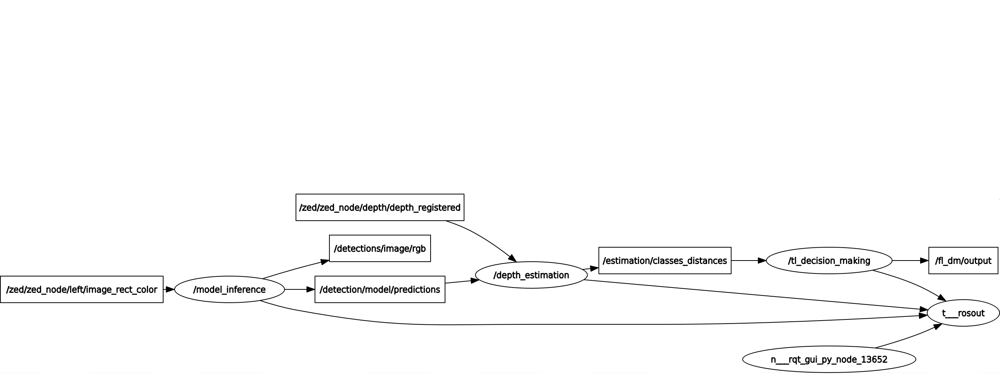
</p>

### 4.2.1. model_inference node
The first built component of the EBDASTL is the TLSDM. This was represented in ROS2 using a rosnode called ```model_inference```. This node is subscribed to ```/zed/zed node/left/image_rect_color```, which are the RGB images from left lens of the ZED Stereo camera at 10 FPS. For each RGB image, the TLSDM performs the model inference. Finally, the bounding box coordinates and classes found by the detection model are published to the topic ```/detection/model/predictions```, and the RGB images with the bounding boxes plotted are published to ```detections/image/rgb```. The rqt graph of the subscribers and publishers of the model inference node can be shown below:

<p align="center">
  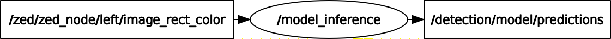
</p>

### 4.2.2. depth_estimation node
The second built component of the EBDASTL is the TLD. This was represented in ROS2 using a rosnode called ```depth estimation```. This node is subscribed to ```/zed/zed node/depth/depth_registered``` and ```/detection/model/predictions```. The first one receives the depth map generated from the ZED Stereo Camera at 10 FPS, and the second subscription gets the bounding box coordinates and classes from the previous component. For each pair of depth map images and the bounding box coordinates, the TLD is estimated by locating the bounding box coordinates
from the RGB image into the depth map image generated by the ZED Stereo camera, as both have the same resolution, then this provides the location of the TL in the depth map image. Once the TL was located in the depth map, then the median value of all the pixels within the
bounding box is published, as well as, the classes provided by model inference component are published to the ```/estimation/classes_distances```. The rqt graph of the subscribers and publishers of the depth estimation node can be shown below:

<p align="center">
  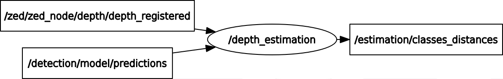
</p>

### 4.2.3. tl_decision_making node
The last component built of the EBDASTL is the TLDM. This was represented in ROS2 using a rosnode called ```tl_decision_making```. This node is subscribed to ```/estimation/classes distances```, which is the TL distance and classes estimated from depth estimation node. This information is fed into the Fuzzy Model, where the TLD is represented as a float number from 0 to 15 meters, and the TLS is represented with an integer value from 1 to 4 each representing a TLS.The Fuzzy Model outputs the Brake Signal, which is a float number from -1 to 1, where -1
represents that no TL was detected and 0 to 1 is the range of operation of the Brake Signal. The rqt graph of the subscribers and publishers of the tl decision making node can be shown below:

<p align="center">
  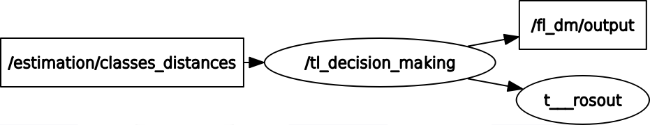
</p>

## 4.3. tl_interfaces package
This package contains all the custom messages required for the ADAS. These are used in the ```TL_Perception``` package.

# 5. On Road Experiment
This includes the ***Setup of the Experiment***, ***Tests Perform with the EBDASTL***, ***Performance Metrics of the EBDASTL***.
The experiment was developed in Av. Epigmenio González, San Pablo, 76130 Santiago de Queretaro, Queretaro, Mexico. This localization was selected given that there is a TL and the traffic is low.

## 5.1. Setup of the Experiment
he setup of all the electronic components is required before starting the experiment. The components involved in this experiment were Volkswagen Vento model 2015, Truper Power Inverter, Computer Monitor, Jetson TX2, ZED Stereo Camera, USB HUB, mouse, and a
keyboard. The connections of the components were set up as follows: The car’s battery positive and negative terminal was connected to the truper power inverter. The power inverter has two power outlets, one of them fed the computer monitor and the other one fed the Jetson
TX2. The Jetson TX2 is displayed on the computer monitor using an HDMI connection. Additionally, the Jetson’s TX2 USB port is connected to a USB hub, and this hub connects the ZED Stereo Camera, keyboard, and mouse. The connection of the electric components is shown below:

<p align="center">
  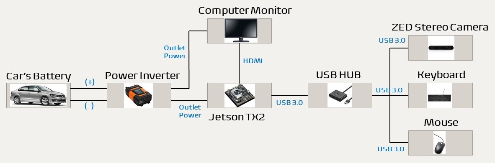
</p>

The external and internal connections can be shown below:
<p align="center">
  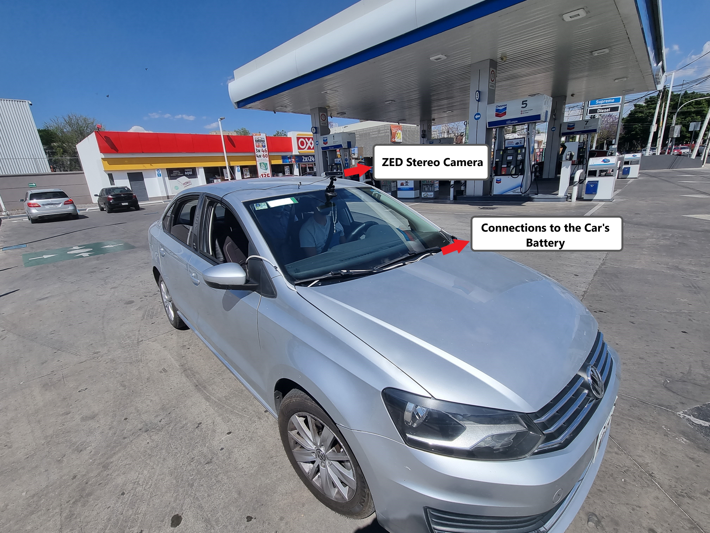
</p>
<p align="center">
  
</p>
Finally, six landmarks were defined at 5, 7, 9, 11, 13, and 15 meters from the TL in the experimentation location. The exact location and the surroundings of the TL can be shown below:
<p align="center">
  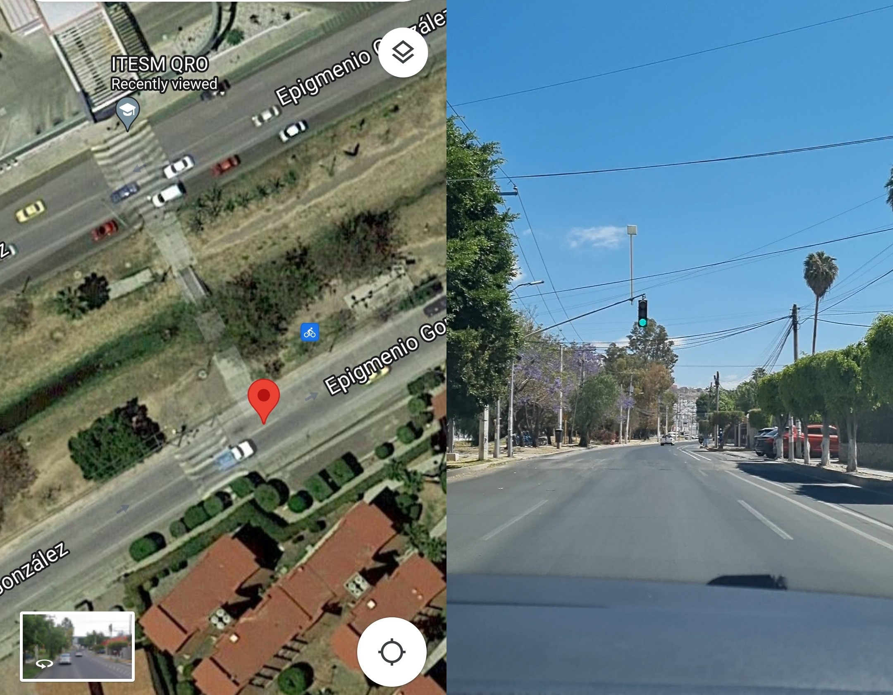
</p>

## 5.2. Tests Perform with the EBDASTL
The values provided by the EBDASTL at 5, 7, 9, 11, 13, 15 meters of the estimated distance and the brake signal values can be shown in tables 4.5, 4.6, 4.7, 4.8, 4.9, 4.10. For each experiment, ten samples were used to fill up the content of each table.
<p align="center">
  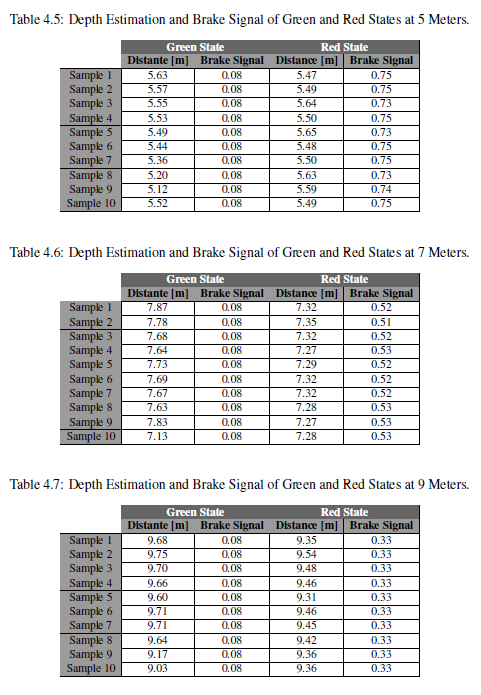
</p>
<p align="center">
  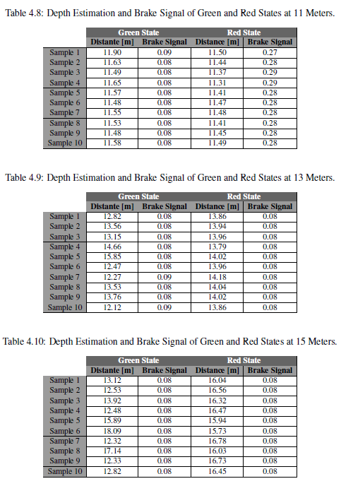
</p>

## 5.3. Performance Metrics of the EBDASTL
In this subsection, the ***mAP of detections***, ***RMSE of the estimated distances***, the ***expected values of the fuzzy model***, and the ***response time of the EBDASTL are covered***.

### 5.3.1. mAP of the Detections
For the evaluation of the detections, the mAP at different IoU are considered. The Green and
Red States and evaluated together and the results can be shown below:
<p align="center">
  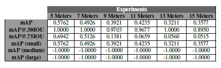
</p>

### 5.3.2. RMSE of the Estimated Distances
The distribution of the TLDs estimated by the EBDASTL are seperated into Green State and Red State, these can be shown in the following images.
<p align="center">
  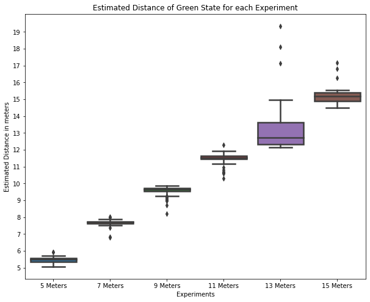
</p>
<p align="center">
  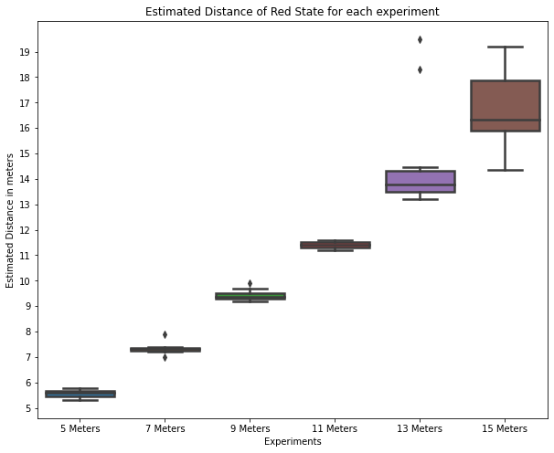
</p>

The RMSE was calculated for each of TLS and TLD, in table 4.12 the RMSE values are reported.
<p align="center">
  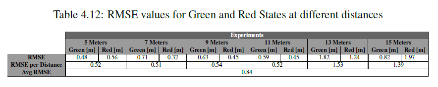
</p>

### 5.3.3. Fuzzy Model Expected Outputs
The fuzzy model can not be tested as it is an open-loop controller, however, in the following figures all the input cases were fed to the fuzzy model system to determine the behavior of the brake signal.
<p align="center">
  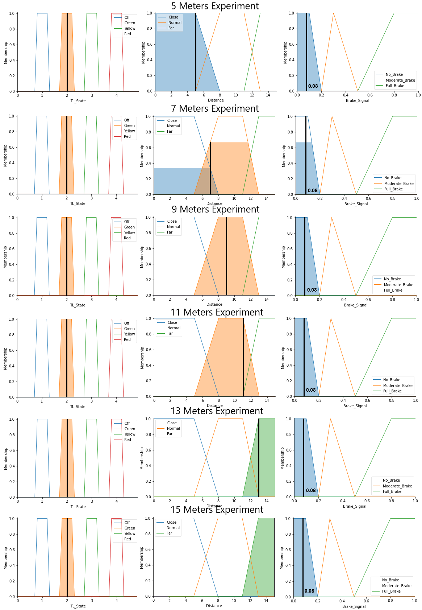
</p>
<p align="center">
  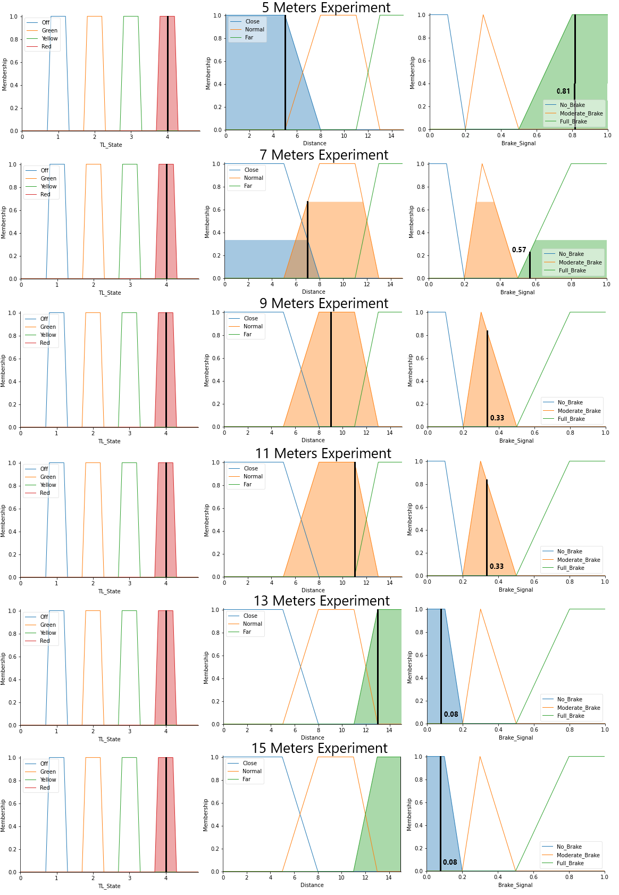
</p>

Once all the brake signal values have been calculated for all the TLSs and TLDs, then the values obtained in the On Road Experiment can be compared. In the following figures, it can be shown the box plots of the Green,and Red states at different distances.
<p align="center">
  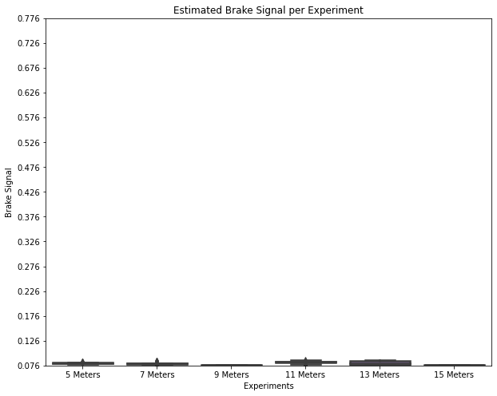
</p>
<p align="center">
  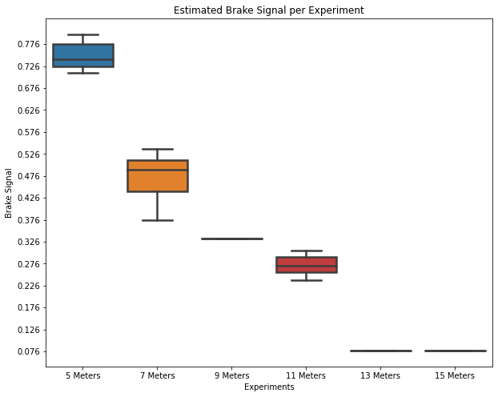
</p>

### 5.3.4. EBDASTL Response Time
The last important metric is the response time of the EBDASTL, as described in the previous
section Component Integration using ROS2, the system is composed of three stages, and the
ZED Wrapper. Therefore, the following figure a box plot can be shown comparing time responses
of all the stages of the EBDASTL.
<p align="center">
  
</p>

### 5.3.5. Videos of the EBDASTL
In this subsections we provide several videos of the EBDASTL.

Green State at Different Distances      |  Red State at Different Distances
:-------------------------:|:-------------------------:
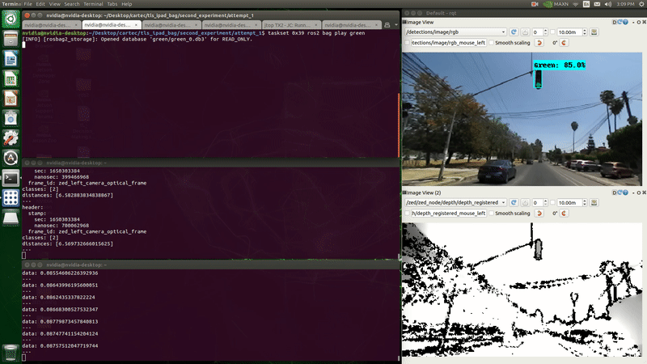  |  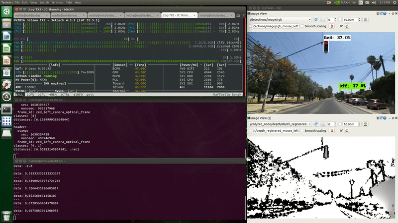
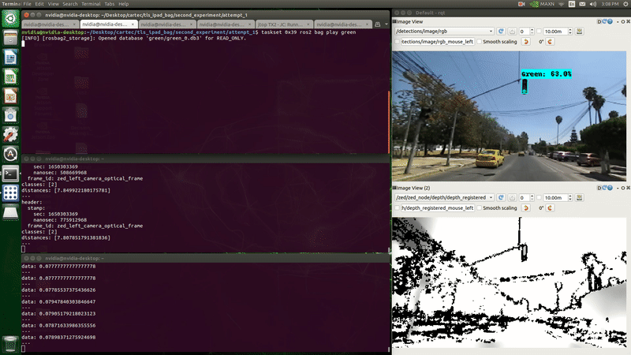  |  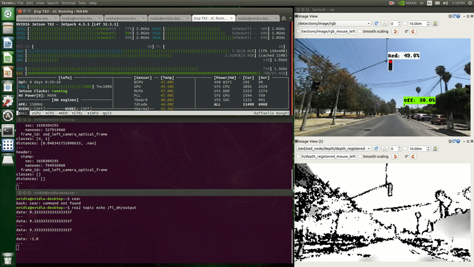
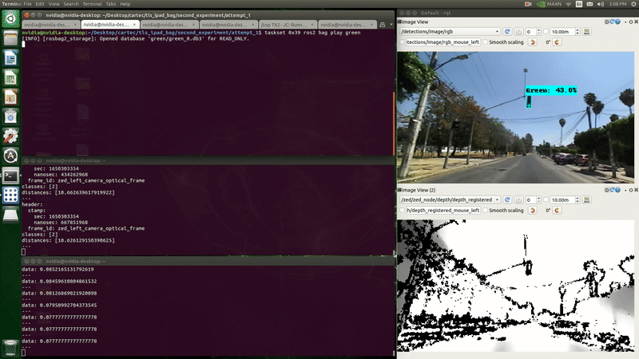  |  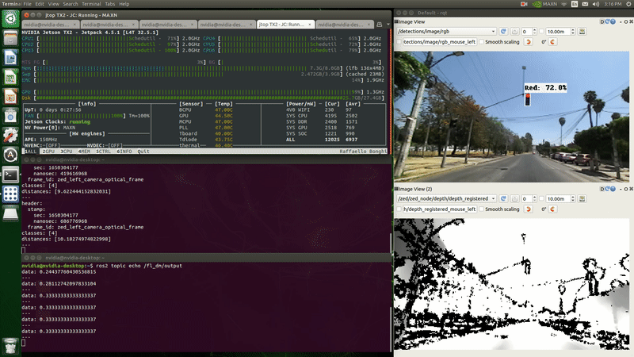
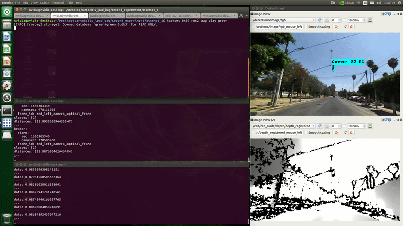  |  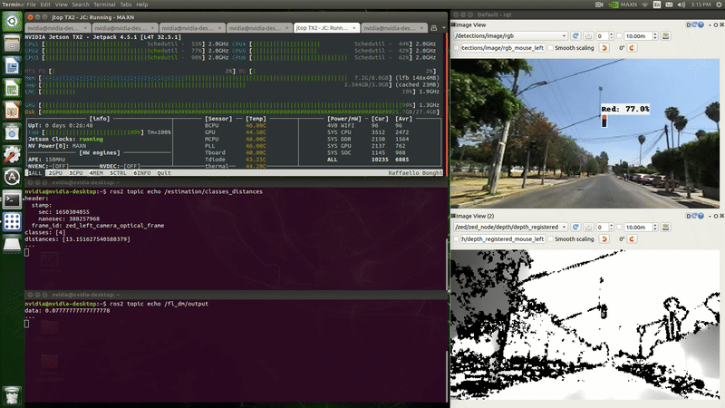
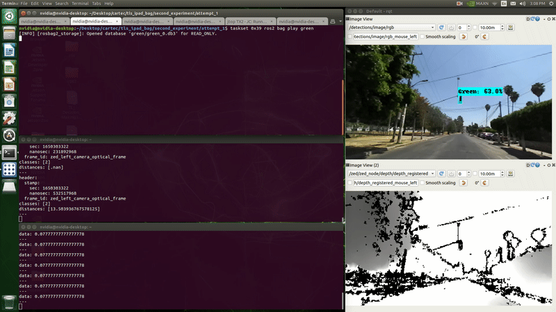  |  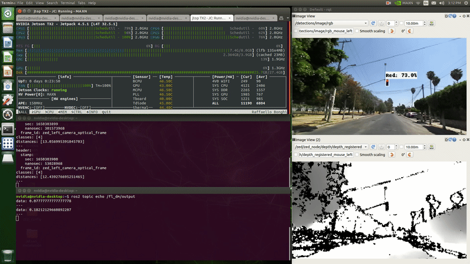
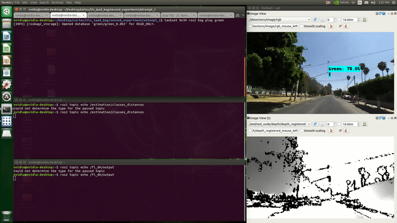  |  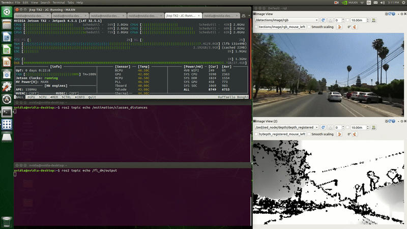

<!-- LICENSE -->
## License

Distributed under the MIT License. See `LICENSE` for more information.

<!-- MARKDOWN LINKS & IMAGES -->
<!-- https://www.markdownguide.org/basic-syntax/#reference-style-links -->
[contributors-shield]: https://img.shields.io/github/contributors/othneildrew/Best-README-Template.svg?style=for-the-badge
[contributors-url]: https://github.com/othneildrew/Best-README-Template/graphs/contributors
[forks-shield]: https://img.shields.io/github/forks/othneildrew/Best-README-Template.svg?style=for-the-badge
[forks-url]: https://github.com/othneildrew/Best-README-Template/network/members
[stars-shield]: https://img.shields.io/github/stars/othneildrew/Best-README-Template.svg?style=for-the-badge
[stars-url]: https://github.com/othneildrew/Best-README-Template/stargazers
[issues-shield]: https://img.shields.io/github/issues/othneildrew/Best-README-Template.svg?style=for-the-badge
[issues-url]: https://github.com/othneildrew/Best-README-Template/issues
[license-shield]: https://img.shields.io/github/license/othneildrew/Best-README-Template.svg?style=for-the-badge
[license-url]: https://github.com/othneildrew/Best-README-Template/blob/master/LICENSE.txt

